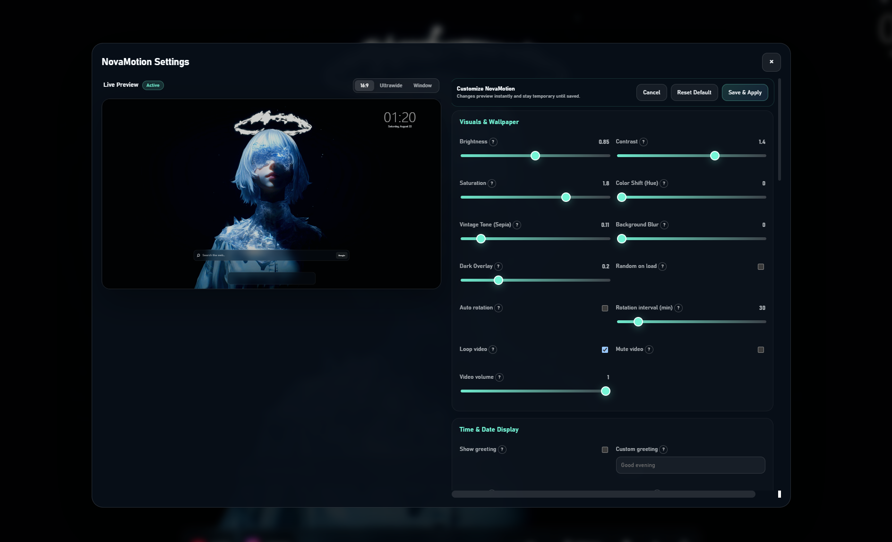
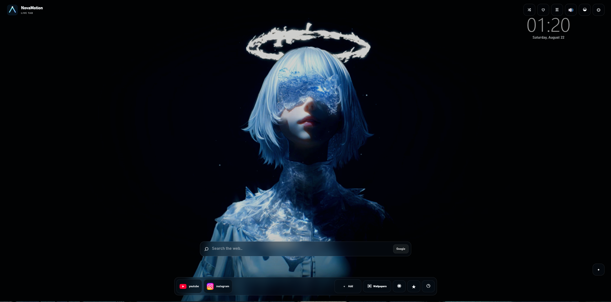

# NovaMotion Live Tab

> A modern, ultra-lightweight, and privacy-first Chrome New Tab extension featuring local live wallpapers, 3D depth parallax, multi-calendar support, quick notes, smart shortcuts, and a pixel-perfect live customization engine.

---

## 📸 Preview & Screenshots

  

  

---

## ✨ Key Features

- 🎥 **Local Live Wallpapers**: High-performance video & image decoding stored locally via IndexedDB with zero cloud dependency.
- 📱 **Depth & Parallax Engine**: Smooth mouse-tracking parallax perspective with zero-idle CPU overhead.
- 🎨 **Visual Engine Tuning**: Real-time Brightness, Contrast, Saturation, Hue Rotation, and Sepia adjustments.
- 📅 **Multi-Calendar Systems**: Support for Gregorian, Solar, Islamic, Hebrew, and Asian calendar formats.
- 📐 **Absolute Freedom Layout**: Freely position the clock, calendar, and search bar with percentage-based responsive coordinates.
- 🪄 **Responsive Live Preview**: Real-time virtual canvas simulation for 16:9, Ultrawide, and custom windowed aspect ratios.
- 📝 **Smart Quick Notes**: Auto-saving persistent local notepad.
- ⏱ **Pomodoro Focus Suite**: Configurable focus/break cycles with ambient background dimming.

---

## 🚀 Quick Installation

1. Download the latest `.zip` release from the [Releases](https://github.com/amiraction0938/NovaMotion-Live-Tab/releases) page.
2. Unpack the downloaded archive to a local folder.
3. Open Google Chrome and go to `chrome://extensions/`.
4. Enable **Developer mode** in the top-right corner.
5. Click **Load unpacked** and select the folder containing `manifest.json`.
6. Open a new tab to launch NovaMotion.

---

## 🔒 Privacy

- **100% Local-First**: Your media, notes, and preferences remain strictly inside your browser profile.
- **Zero Telemetry**: No tracking, analytics, or external network requests.
- **Manifest V3 Compliant**: Built to strict modern security and performance standards.

---

# راهنمای فارسی (Persian Documentation)

> **NovaMotion Live Tab** یک افزونه مدرن، بسیار سبک و امن برای نیوتب (New Tab) گوگل کروم است که امکانات گسترده‌ای برای شخصی‌سازی محیط کاربری و افزایش تمرکز در اختیارتان قرار می‌دهد.

### 🌟 ویژگی‌های کلیدی برای کاربران فارسی‌زبان

- 📅 **پشتیبانی کامل از تقویم شمسی (جلالی)**: نمایش تاریخ دقیق خورشیدی در کنار ساعت با قابلیت انتخاب فونت، اندازه و موقعیت مکانی.
- 🎥 **والپیپرهای زنده محلی**: امکان قرار دادن ویدیو، گیف و تصاویر باکیفیت بدون کندی سیستم یا مصرف اینترنت.
- 📱 **افکت عمق و حرکت سه‌بعدی**: ایجاد بعد و حرکت نرم عناصر با جابه‌جایی نشانگر ماوس.
- 🎨 **تنظیمات پیشرفته نور و رنگ**: کنترل دقیق کنتراست، روشنایی، غلظت رنگ و فیلترهای جذاب برای پس‌زمینه.
- 📐 **چیدمان کاملاً آزاد**: جابه‌جایی ساعت، تاریخ، تقویم و نوار جستجو به هر نقطه از صفحه نمایش.
- 📝 **یادداشت سریع خودکار**: بدون نیاز به اینترنت یا حساب کاربری، یادداشت‌های خود را ذخیره کنید.

### 📥 راهنمای نصب سریع

۱. فایل فشرده افزونه را از بخش [Releases](https://github.com/amiraction0938/NovaMotion-Live-Tab/releases) دانلود و استخراج (Unzip) کنید.  
۲. در مرورگر کروم آدرس `chrome://extensions/` را باز کنید.  
۳. گزینه **Developer mode** را در بالا سمت راست روشن کنید.  
۴. روی دکمه **Load unpacked** کلیک کرده و پوشه برنامه را انتخاب کنید.  

---

## 👥 Credits & Direction
- **Product Direction & Concept**: AmirAction
- **Development**: Engineered and refined with AI assistance.

## 📄 License
This project is open-source under the [MIT License](LICENSE).
